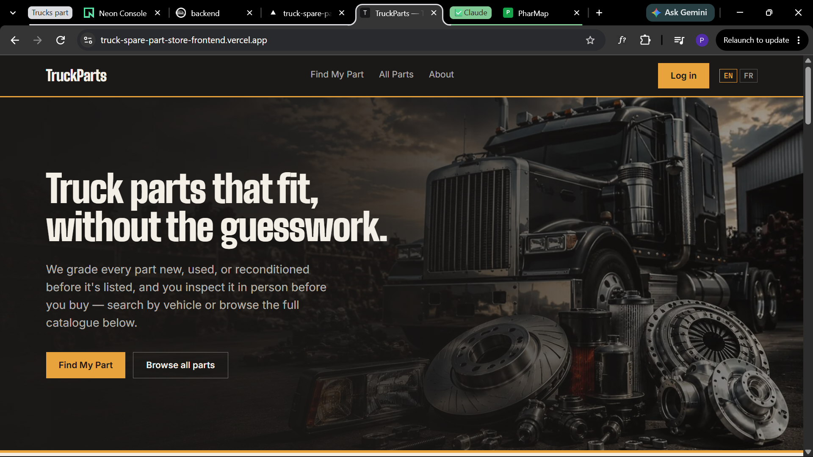
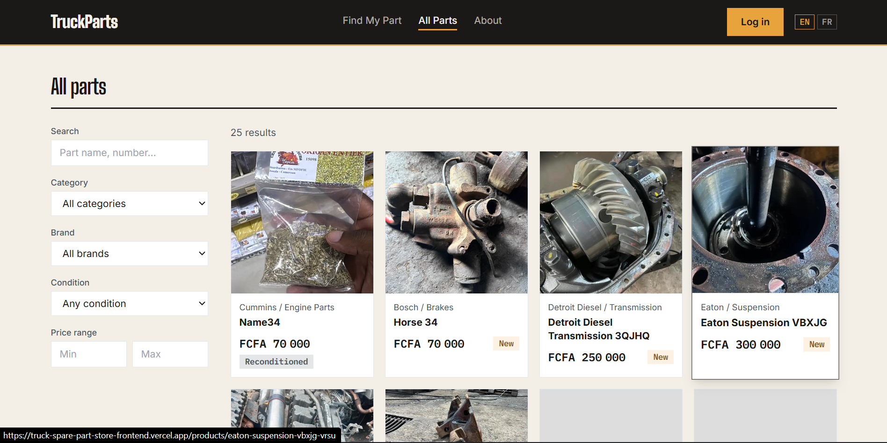
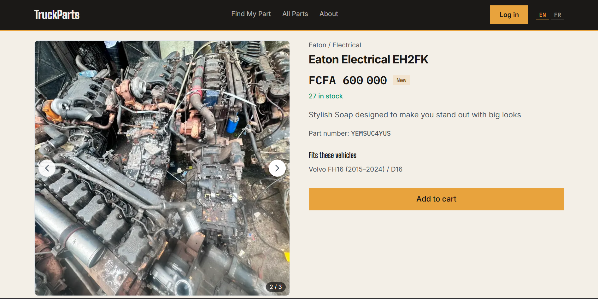
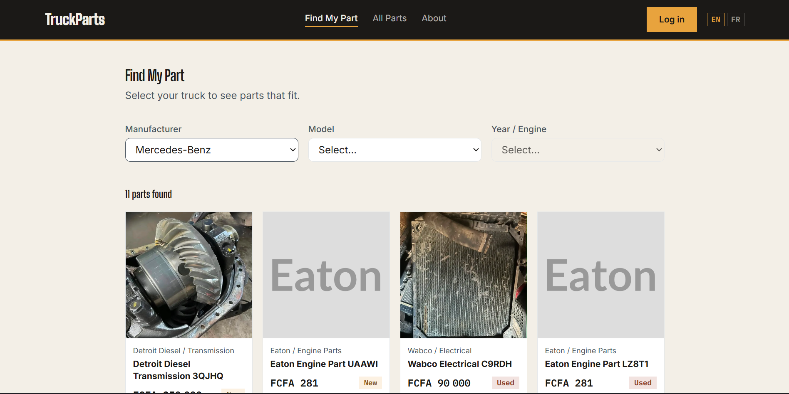
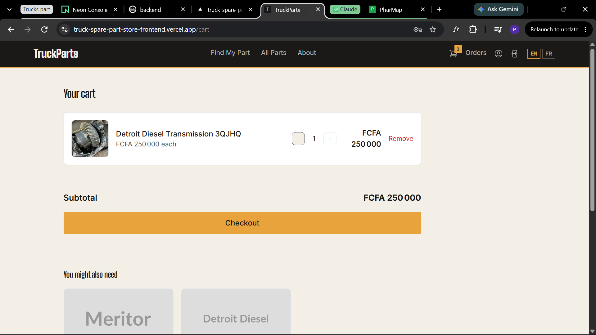
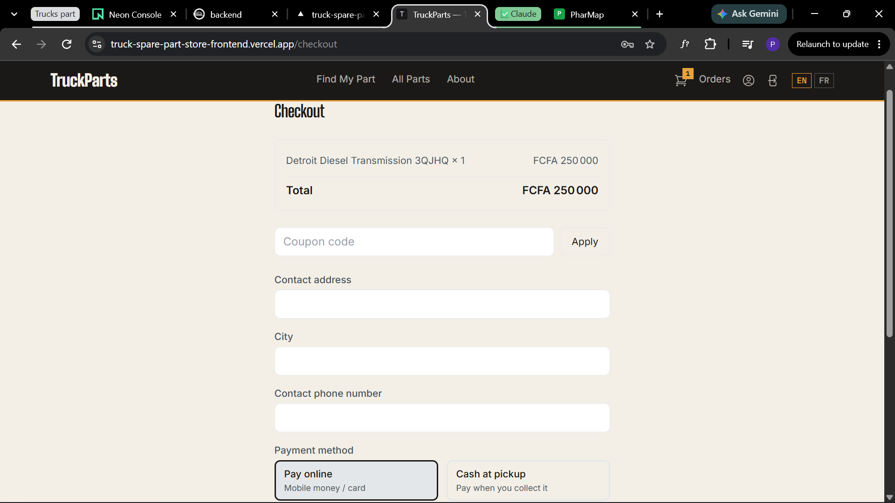
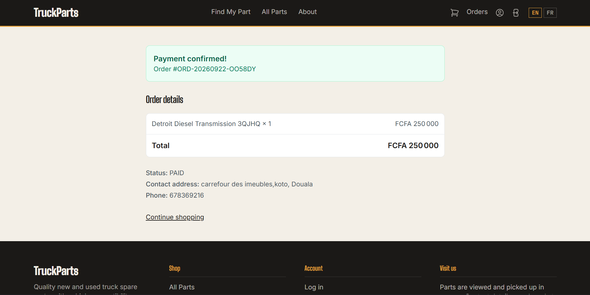
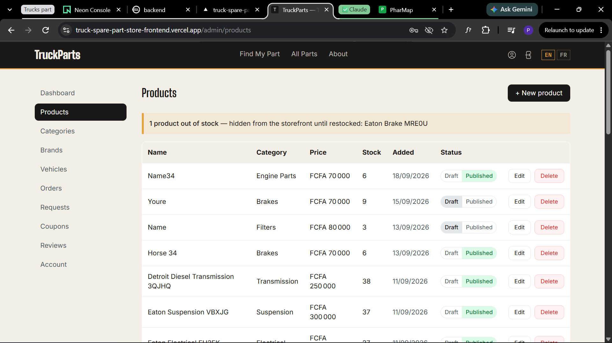
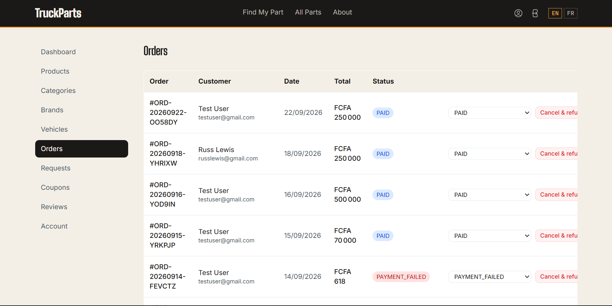

# TruckParts

A full-stack e-commerce store for truck spare parts — single-vendor, production-shaped, built
end to end with Next.js, NestJS, PostgreSQL, and a real payment gateway integration.

**Live demo:** https://truck-spare-part-store-frontend.vercel.app
(sandbox payments only — see [Try it out](#try-it-out) below before you check out)

## Highlights

A few things in here that go beyond CRUD scaffolding:

- **Payment integration, not a mock.** Checkout redirects to Notch Pay's hosted page; the backend
  verifies the return webhook with HMAC-SHA256 over the raw request body using a timing-safe
  comparison, and — since webhooks aren't guaranteed to arrive promptly — also actively
  reconciles any still-pending order against Notch Pay's own API rather than trusting the webhook
  alone.
- **Correct under concurrency.** Checkout reserves stock with a single conditional
  `UPDATE ... WHERE quantity >= requested` inside a DB transaction, so two customers racing for
  the last unit can't both succeed.
- **Auth that doesn't trust `localStorage`.** Short-lived JWT access tokens live in memory only;
  session persistence is an httpOnly refresh cookie plus a CSRF double-submit token, with silent
  refresh-and-retry on an expired access token.
- **Actually accessible.** Passed an axe-core audit pass — landmark roles, labeled nav elements,
  WCAG AA color contrast — not just "looks fine to me."
- **Mobile-first admin panel.** Every admin list view renders as a responsive card list below the
  `sm` breakpoint instead of a sideways-scrolling table, matched to what each list actually needs
  on a phone.
- **i18n done without URL noise.** EN/FR via `next-intl`, cookie-based — no `/en`/`/fr` path
  prefixes cluttering every route.
- **Currency handled correctly.** Prices are in XAF (Central African CFA franc), a zero-decimal
  currency — every amount is rendered and rounded as a whole number, never floating-point cents.
- **Upload pipeline, not a raw file pass-through.** Product images are auto-converted to WebP and
  dimension-capped on upload, then served through the backend rather than exposing object storage
  directly.

## Try it out

The live demo runs against Notch Pay's **sandbox** environment — no real money moves, ever, no
matter what you enter at checkout. Log in with a seeded account (see [below](#seeded-test-accounts))
to explore both the storefront and the admin panel without creating one.

## Screenshots

### Homepage


### Product listing


### Product detail page


### Find My Part (vehicle compatibility search)


### Cart


### Checkout


### Order tracking


### Admin — product list


### Admin — order management


The admin panel also renders every list view as a responsive card list on
mobile (see [Highlights](#highlights) above) — the screenshots here are the
desktop table view.

## Stack

| Layer | Choice | Why |
|---|---|---|
| Frontend | Next.js + TypeScript + Tailwind | App Router for the storefront and the admin panel in one codebase, server components where they help, no separate SPA build to host |
| Backend | NestJS + TypeScript | Structured, testable modules per domain (auth, orders, payments, ...) instead of a flat Express app |
| Database | PostgreSQL + Prisma | Relational integrity for orders/stock/payments, where correctness matters more than schema flexibility |
| Object storage | MinIO (S3-compatible) | Same API shape as production S3, runs locally with zero cloud accounts needed for development |
| Auth | JWT + httpOnly refresh cookie | Short-lived access token in memory (XSS can't read it), long-lived session in a cookie JS can't touch |
| Payments | Notch Pay | Hosted checkout + webhooks, appropriate for mobile money coverage in Central Africa |

## Prerequisites

- Node.js 20+ (LTS)
- Docker Desktop (with WSL2 backend on Windows)
- pnpm (`npm install -g pnpm`)

## First-time setup

1. **Copy the environment file:**
   ```bash
   cp .env.example .env
   ```

2. **Start the local infrastructure (Postgres, MinIO, Mailhog, Adminer):**
   ```bash
   docker compose up -d
   ```
   Check everything is healthy:
   ```bash
   docker compose ps
   ```

3. **Install dependencies:**
   ```bash
   pnpm install
   ```

4. **Generate the Prisma client and run the first migration:**
   ```bash
   pnpm prisma:generate
   pnpm prisma:migrate
   ```
   When prompted for a migration name, use something like `init`.

5. **Seed the database with test data:**
   ```bash
   pnpm prisma:seed
   ```

6. **Run the backend and frontend** (in two separate terminals):
   ```bash
   pnpm dev:backend
   pnpm dev:frontend
   ```

Online payments in local dev need a Notch Pay sandbox account (free, at business.notchpay.co) —
drop the three keys it gives you into `NOTCHPAY_PUBLIC_KEY` / `NOTCHPAY_PRIVATE_KEY` /
`NOTCHPAY_WEBHOOK_HASH` in `.env`. Everything else works without it — cash-at-pickup checkout
needs no payment gateway at all.

## Verify everything works

- Backend health check: http://localhost:4000/health
- Backend products API: http://localhost:4000/products
- Frontend: http://localhost:3000
- Database GUI (Adminer): http://localhost:8080
  — System: PostgreSQL, Server: `postgres`, Username/Password/Database: see your `.env`
- Prisma Studio (alternative DB GUI): `pnpm prisma:studio`
- MinIO console: http://localhost:9001
- Mailhog (view test emails): http://localhost:8025

## Seeded test accounts

| Role     | Email                      | Password       |
|----------|-----------------------------|----------------|
| Admin    | admin@truckparts.local      | admin123       |
| Customer | customer@truckparts.local   | customer123    |

> Note: these are simple, publicly-known passwords for local testing only — never reuse them,
> and never run the seed script against a shared or production database.

### Read-only demo admin

On the live demo, `admin@truckparts.local` is a **read-only demo account**, so visitors can
explore the whole admin panel without being able to change anything. It keeps its `ADMIN` role,
but its access token carries a `demo` claim, and a global NestJS interceptor
(`DemoReadOnlyInterceptor`) rejects every `POST`/`PUT`/`PATCH`/`DELETE` it sends with a 403.
Its password can't be reset either, so one visitor can't lock everyone else out.

- Which accounts are demo accounts: `DEMO_ACCOUNT_EMAILS` (comma-separated). Unset means
  `admin@truckparts.local`. Empty (as in `.env.example`) means none, so locally the seeded admin
  stays fully editable.
- The login page shows the demo credentials only when `NEXT_PUBLIC_DEMO_EMAIL` and
  `NEXT_PUBLIC_DEMO_PASSWORD` are set on the frontend.

## Project structure

```
apps/
  backend/    NestJS API
  frontend/   Next.js storefront
packages/
  prisma/     Database schema, migrations, seed script
docker-compose.yml  Local infrastructure (Postgres, MinIO, Mailhog, Adminer)
```

## Scope (V1)

Single-vendor store — no multi-vendor, commission, or subscription logic. Functional scope:
product catalog, vehicle compatibility search ("Find My Part"), cart & checkout (online via
Notch Pay or cash-at-pickup), order tracking, coupons, reviews, product requests, and a full
admin panel for all of the above.

## Author

**Forsangam Weyegho Junior Priestly** — Full-Stack Web Developer
[LinkedIn](https://www.linkedin.com/in/forsangam-weyegho-junior-priestly-965897236) ·
[GitHub](https://github.com/Naviolance) ·
forsangamjunior@gmail.com

## License

© 2026 Forsangam Weyegho Junior Priestly (JPFW Web Services). All rights reserved.

This code is public so clients and employers can review my work. It is **not open source**: you may not copy, deploy, modify or sell it without my written permission. See [LICENSE](LICENSE).
