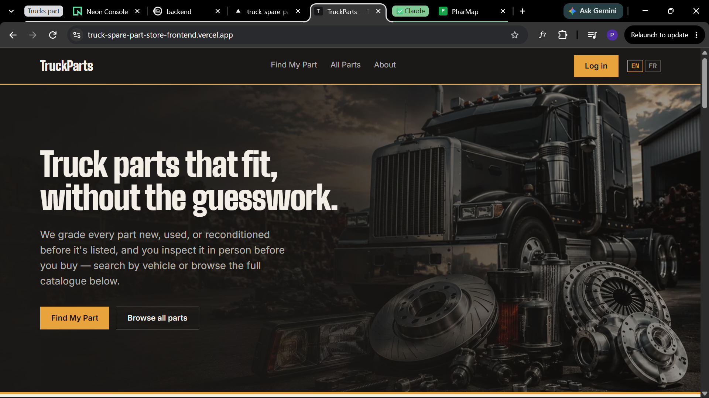
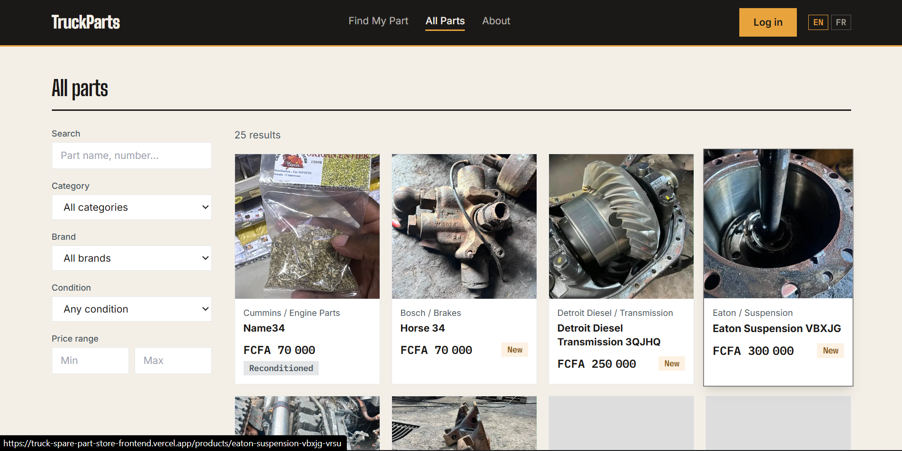
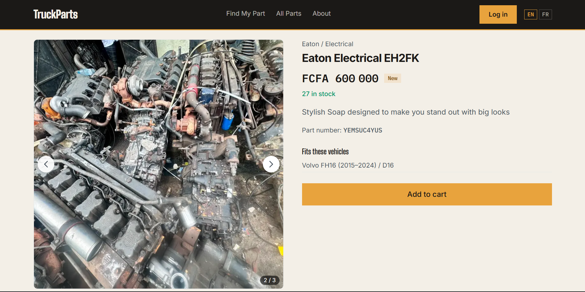
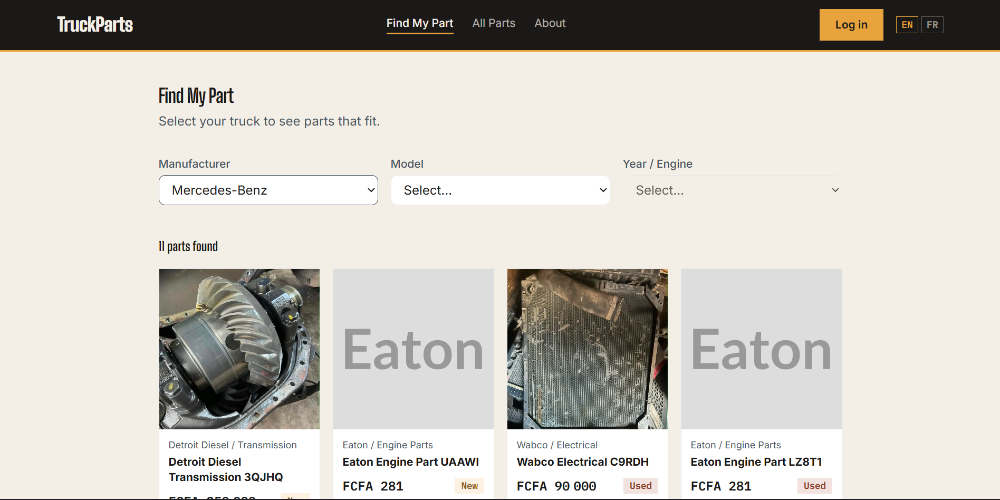
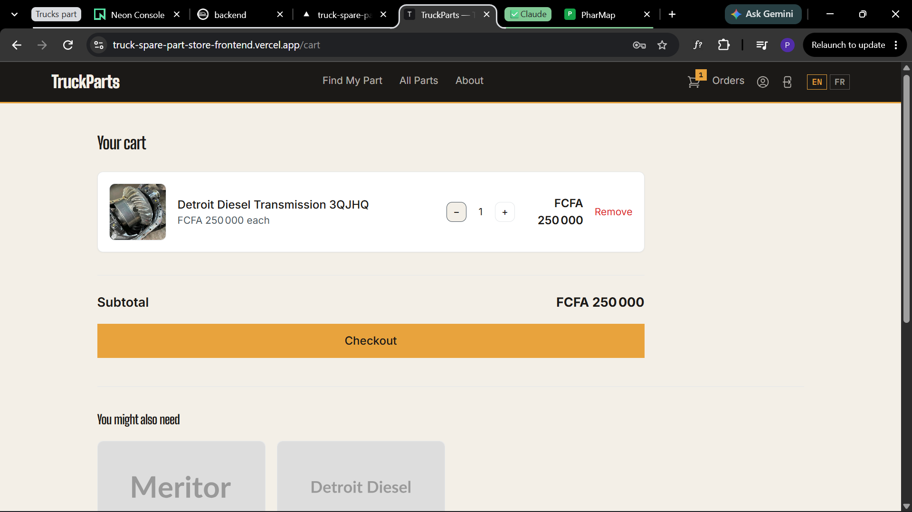
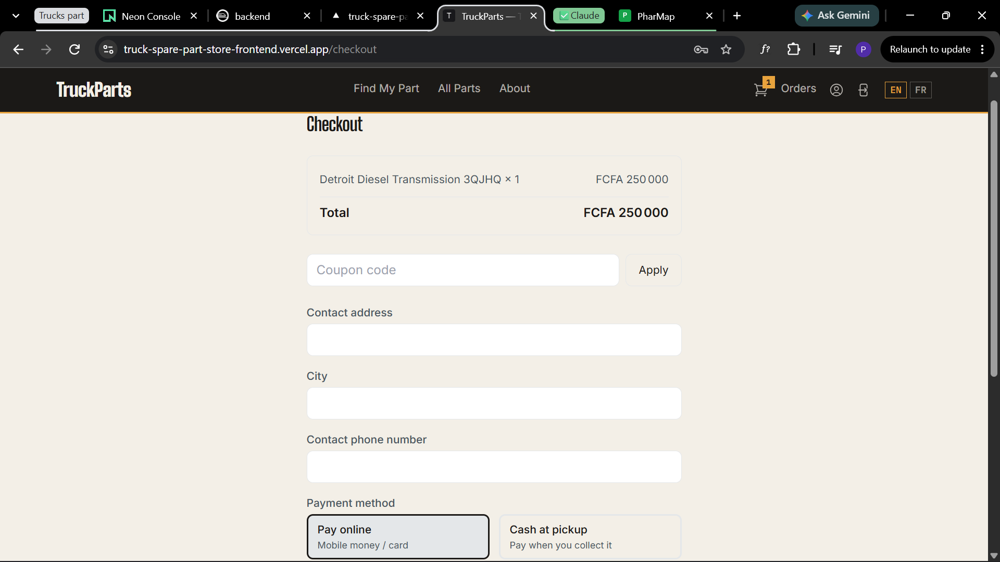
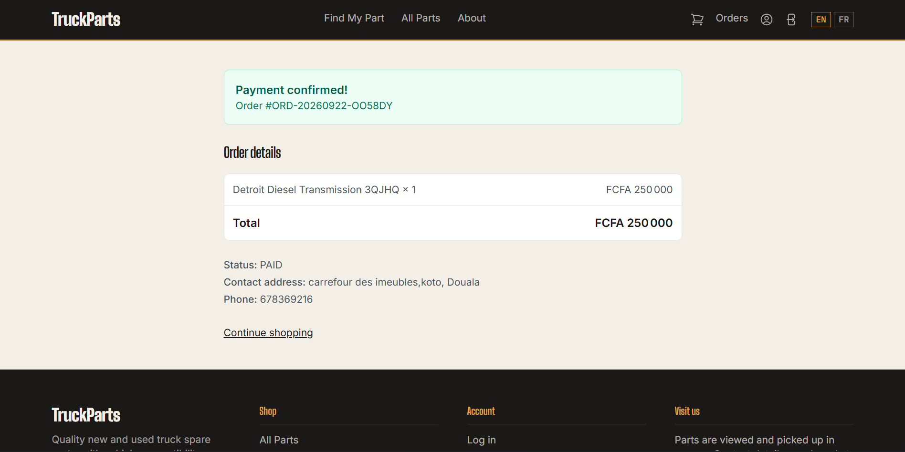
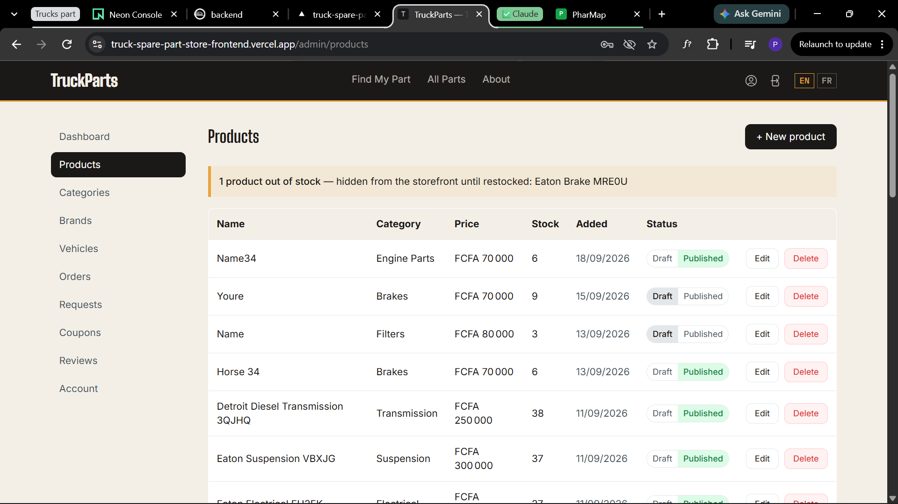
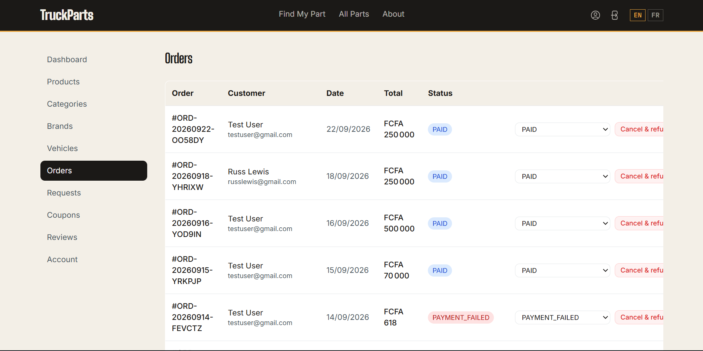

# TruckParts

An online store for truck spare parts. Customers check that a part fits their truck, order and
pay in cash at pickup (online payment plugs in per provider), track their order, or ask for a
part on WhatsApp. The owner runs the store from an admin panel that also works on a phone.

**Live demo:** https://truck-spare-part-store-frontend.vercel.app
(sandbox payments only, see [Try it out](#try-it-out))
**Case study:** https://jpfw-webservices.vercel.app/en/projects/truckparts

## Overview

A truck parts seller needs more than a product list. Customers need to know a part fits their
vehicle before they buy. Payments have to be real, not a fake button. And when two people try to
buy the last unit at the same time, only one of them can get it.

TruckParts is a single-vendor store built for that: a Next.js storefront and admin panel, a
NestJS API, and PostgreSQL, with a real payment gateway and order handling that stays correct
under concurrency.

## Features

- **Find My Part.** Customers filter parts by the truck they own (manufacturer, model and year), with
  search filters kept in the URL so a result can be shared.
- **Provider-agnostic payments.** Cash at pickup today; online payment plugs in as one adapter
  file behind a `PaymentProvider` interface (Notch Pay is the reference adapter). Each payment
  attempt is its own record, so a failed or abandoned payment can be retried, and results are
  applied idempotently whether they arrive by signed webhook or by polling the provider.
- **Order state machine.** Every status change goes through one server-side transition table with
  a conditional update, so concurrent webhooks, polls, admin clicks and the expiry job can never
  restock twice. Unpaid orders expire automatically and release their stock.
- **No overselling.** Checkout reserves stock with one conditional
  `UPDATE ... WHERE quantity >= requested` inside a transaction, so two customers racing for the
  last unit can't both succeed. A failed payment puts the stock back.
- **Safer sessions.** Short-lived JWT access tokens stay in memory, never in `localStorage`. The
  session is an httpOnly refresh cookie, rotated on every refresh, with reuse detection and a
  CSRF double-submit token. Passwords are hashed with bcrypt; login is rate limited.
- **Admin panel.** Products, categories, brands, vehicles, orders, coupons, reviews and product
  requests. Every list turns into cards on small screens instead of a table you scroll sideways.
- **Bulk import from a spreadsheet.** Admin → Import takes a CSV saved from Excel (French or
  English headers, `;` or `,`, accents preserved). A preview lists every error by line before
  anything is written; the import itself is all-or-nothing. Re-uploading the same sheet updates
  products by part number + brand, so one master spreadsheet keeps prices and stock current.
- **Read-only demo admin.** Visitors can explore the whole admin panel with a published demo
  account that can't change anything (details [below](#read-only-demo-admin)).
- **Image uploads.** Product images are converted to WebP and size-capped on upload, stored in
  S3-compatible storage, and served through the backend so the bucket is never exposed.
- **English and French, both indexable.** `/fr/...` and `/en/...` URLs with hreflang, French by
  default; every page, email-facing string and category name is translated.
- **Built to be found.** Server-rendered catalog with crawlable pagination, category / brand /
  truck landing pages, Product + Offer + Breadcrumb + FAQ JSON-LD, sitemap with hreflang,
  `llms.txt` for answer engines, and part-number search that ignores spaces and dashes.
- **Built to convert.** WhatsApp on every page (pre-filled per product and order), guest part
  requests with phone number for out-of-stock or unlisted parts, and admin email alerts for new
  orders and requests.
- **XAF prices.** The Central African CFA franc has no decimals, so every amount is a whole
  number. No floating-point cents.
- **Accessibility.** Passed an axe-core audit: landmark roles, labeled navigation, WCAG AA color
  contrast.
- **Operations.** Sentry error monitoring, cookieless Umami analytics with business events
  (searches with no results, WhatsApp clicks, part requests), and scripts to promote the admin
  and clear test data at launch ([docs/LAUNCH.md](docs/LAUNCH.md)).
- **Also:** order tracking, coupons, verified-purchase reviews, password change and reset by email.

## Try it out

Where online payment is enabled on the demo, it uses Notch Pay's **sandbox**, so no real money
moves, whatever you enter at checkout. To see the admin panel, use the read-only demo account shown on the login page.

## Screenshots

### Homepage


### Product listing


### Product detail page


### Find My Part (vehicle compatibility search)


### Cart


### Checkout


### Order tracking


### Admin: product list


### Admin: order management


The screenshots show the desktop admin tables. On a phone, every list becomes a card list.

## Tech stack

| Layer | Choice | Why |
|---|---|---|
| Frontend | Next.js (App Router) + TypeScript + Tailwind CSS | One codebase for the storefront and the admin panel, server components where they help |
| Backend | NestJS + TypeScript | One module per domain (auth, orders, payments, uploads...), easier to test than one flat Express app |
| Database | PostgreSQL + Prisma | Orders, stock and payments need relational integrity and transactions |
| Object storage | S3-compatible: MinIO locally, Backblaze B2 in production | Same S3 API in both places, so no code changes between local and production |
| Auth | JWT access token + httpOnly refresh cookie | The short-lived token stays in memory, the session in a cookie JavaScript can't read |
| Payments | Provider adapters (Notch Pay reference) | Hosted checkout and webhooks behind one interface; cash at pickup always available |
| Email | Nodemailer over SMTP: Mailhog locally, Resend in production | Password reset emails, testable locally without sending real mail |
| i18n | next-intl | English and French |

## Architecture

```
Browser
  │
  ▼
Next.js frontend (Vercel)
  │  API calls go to /api/backend/*, which Next.js rewrites to the backend,
  │  so the auth cookie is first-party (see next.config.js)
  ▼
NestJS API (Railway)
  ├── PostgreSQL (Neon) ........ via Prisma
  ├── Backblaze B2 ............. product images, S3 API
  ├── Payment provider ......... (optional) hosted checkouts + signed webhooks
  └── Resend (SMTP) ............ password reset emails
```

- **Monorepo** with pnpm workspaces: `apps/frontend`, `apps/backend`, and `packages/prisma`
  (schema, migrations and seed script shared by the backend).
- **Checkout is two steps.** `POST /orders` creates the order as `PAYMENT_PENDING` and reserves
  stock in a transaction. Payment is then chosen (cash, or online via the configured provider);
  the order only becomes `PAID` through a verified provider result or an admin confirming cash.
  Unpaid orders expire (`EXPIRED`) and release their stock.
- **Images are proxied** by the backend (`/uploads/file/...`) instead of linking to the bucket, so
  the frontend only ever talks to one origin.

## Technical decisions

- **API calls go through a Next.js rewrite.** The frontend (vercel.app) and backend (railway.app)
  are different sites. Browsers that block third-party cookies (Safari always, others often)
  wouldn't keep the session cookie. Routing calls through `/api/backend` makes it a first-party
  cookie.
- **Stock is reserved with one conditional UPDATE**, not "read stock, then write". The read-then-
  write version has a race window; the single statement doesn't.
- **Webhook verification uses the raw request body.** Payment providers sign the exact bytes they send, so
  `main.ts` keeps `req.rawBody` for the signature check. Verifying against re-serialized JSON
  would fail on harmless formatting differences.
- **Rate limits are per user, not per site.** Behind proxies every request looked like it came
  from the proxy; buckets are now keyed by verified user id, or the real client IP
  (`TRUST_PROXY`), and the frontend's own server renders are exempt.
- **One catalog query.** Search, Find My Part and every landing page share one SQL builder, so
  out-of-stock ordering, part-number normalisation and filters are defined once.
- **Read-only demo mode is one global interceptor**, not checks in each controller. New routes
  are covered automatically. It's an interceptor rather than a global guard because global guards
  run before `JwtAuthGuard` has identified the user.
- **S3 API everywhere.** Local MinIO and production Backblaze B2 speak the same protocol, so
  switching is only environment variables.

## Running locally

### Prerequisites

- Node.js 20+ (LTS)
- Docker Desktop (with the WSL2 backend on Windows)
- pnpm (`npm install -g pnpm`)

### First-time setup

1. **Copy the environment file:**
   ```bash
   cp .env.example .env
   ```

2. **Start the local services (Postgres, MinIO, Mailhog, Adminer):**
   ```bash
   docker compose up -d
   docker compose ps   # check they're healthy
   ```

3. **Install dependencies:**
   ```bash
   pnpm install
   ```

4. **Generate the Prisma client and run the migrations:**
   ```bash
   pnpm prisma:generate
   pnpm prisma:migrate
   ```

5. **Seed the database with test data:**
   ```bash
   pnpm prisma:seed
   ```

6. **Run the backend and the frontend**, each in its own terminal:
   ```bash
   pnpm dev:backend    # http://localhost:4000
   pnpm dev:frontend   # http://localhost:3000
   ```

Everything works locally without a payment provider: checkout is cash at pickup. To try the
Notch Pay adapter, set `PAYMENT_PROVIDER=notchpay` and its sandbox keys in `.env`.

### Check that everything works

- Backend health check: http://localhost:4000/health
- Products API: http://localhost:4000/products
- Frontend: http://localhost:3000
- Adminer (database GUI): http://localhost:8080 (System: PostgreSQL, Server: `postgres`,
  credentials from your `.env`)
- Prisma Studio: `pnpm prisma:studio`
- MinIO console: http://localhost:9001
- Mailhog (see test emails): http://localhost:8025

## Environment variables

- **Backend and Docker** read the `.env` at the repo root (copied from `.env.example`).
- **The frontend** (Next.js in `apps/frontend`) doesn't read the root `.env`. Locally it needs
  nothing: it falls back to `http://localhost:4000` for the API. To override a frontend value,
  put it in `apps/frontend/.env.local`. In production, frontend variables are set in Vercel.

The values in `.env.example` are for local development only. Never commit real keys.

| Variable | Used by | What it's for |
|---|---|---|
| `DATABASE_URL` | backend, Prisma | PostgreSQL connection string |
| `POSTGRES_USER`, `POSTGRES_PASSWORD`, `POSTGRES_DB`, `POSTGRES_PORT` | Docker | Local Postgres container |
| `BACKEND_PORT` | backend | Local port (4000). Railway sets `PORT` instead |
| `BACKEND_PUBLIC_URL` | backend | Public URL of the API, used to build product image URLs |
| `JWT_SECRET` | backend | Signs access tokens. Use a long random value in production |
| `JWT_ACCESS_EXPIRES_IN` | backend | Access token lifetime (default `5m`) |
| `DEMO_ACCOUNT_EMAILS` | backend | Read-only demo accounts. Unset = `admin@truckparts.local`, empty = none |
| `FRONTEND_URL` | backend | Allowed CORS origin in production, and the base of reset links |
| `NEXT_PUBLIC_API_URL` | frontend | Backend URL the `/api/backend` rewrite points to |
| `NEXT_PUBLIC_SITE_URL` | frontend | Public URL of the storefront |
| `NEXT_PUBLIC_DEMO_EMAIL`, `NEXT_PUBLIC_DEMO_PASSWORD` | frontend | Optional. Shows the demo login on the login page |
| `MINIO_ENDPOINT`, `MINIO_PUBLIC_URL`, `MINIO_REGION`, `MINIO_BUCKET` | backend | S3-compatible storage (MinIO locally, Backblaze B2 in production) |
| `MINIO_ROOT_USER`, `MINIO_ROOT_PASSWORD` | backend, Docker | Storage access keys |
| `MINIO_PORT`, `MINIO_CONSOLE_PORT` | Docker | Local MinIO ports |
| `MAIL_HOST`, `MAIL_PORT`, `MAIL_USER`, `MAIL_PASSWORD`, `MAIL_FROM` | backend | SMTP for emails (Mailhog locally, Resend in production) |
| `MAILHOG_WEB_PORT` | Docker | Local Mailhog inbox port |
| `PAYMENT_PROVIDER` | backend | Online payment adapter (`notchpay`); empty = cash only |
| `NOTCHPAY_PUBLIC_KEY`, `NOTCHPAY_PRIVATE_KEY`, `NOTCHPAY_WEBHOOK_HASH` | backend | Notch Pay adapter keys (only with `PAYMENT_PROVIDER=notchpay`) |
| `ORDER_PAYMENT_TTL_MINUTES`, `CASH_PICKUP_TTL_HOURS` | backend | When unpaid orders expire and release stock (60 min / 72 h) |
| `ADMIN_NOTIFICATION_EMAIL` | backend | Where new-order, part-request and payment alerts go |
| `TRUST_PROXY` | backend | Proxy hops in front of the API, for real client IPs (see docs/LAUNCH.md) |
| `INTERNAL_API_KEY` | backend + frontend | Lets the frontend's server renders skip rate limiting |
| `SENTRY_DSN` / `NEXT_PUBLIC_SENTRY_DSN` | backend / frontend | Error monitoring; empty = off |
| `NEXT_PUBLIC_WHATSAPP_NUMBER` | frontend | Business WhatsApp, digits with country code |
| `NEXT_PUBLIC_UMAMI_WEBSITE_ID`, `NEXT_PUBLIC_UMAMI_DOMAINS` | frontend | Cookieless analytics; empty = off |
| `NEXT_PUBLIC_GOOGLE_SITE_VERIFICATION` | frontend | Google Search Console ownership |

## Tests

The backend has unit tests (Jest) for authentication, sessions, password reset, the demo
read-only mode, error codes, import parsing and more, plus tests against a real Postgres:

```bash
pnpm --filter backend test      # unit tests
pnpm --filter backend test:db   # real Postgres: order transitions and races, search triggers, import, insights
pnpm --filter backend lint
pnpm --filter frontend lint
pnpm --filter frontend build    # also type-checks the frontend
```

**CI** ([.github/workflows/ci.yml](.github/workflows/ci.yml)) runs all of the above on every pull
request, against a fresh Postgres with every migration applied from scratch. Don't merge a red PR.

## Deployment

**Hosting isn't chosen yet** — the costed options (one Railway project vs one VPS, in XAF) are in
[docs/HOSTING.md](docs/HOSTING.md). Don't buy shared/cPanel hosting: it can't run this stack (needs an
always-on Node.js server, PostgreSQL and S3-compatible storage). Whatever the host, the pieces are:
the Next.js frontend, the NestJS backend, PostgreSQL, S3-compatible image storage (Backblaze B2 or
MinIO), SMTP email (Resend) and optionally Sentry + Umami.

The step-by-step go-live checklist (fresh database, environment variables, `TRUST_PROXY`,
Search Console, monitoring, admin account, smoke test, backups) is in
[docs/LAUNCH.md](docs/LAUNCH.md). In production the backend only accepts requests from
`FRONTEND_URL` (CORS), and cookies are `Secure` with `SameSite=None`.

## Seeded test accounts

| Role     | Email                      | Password       |
|----------|----------------------------|----------------|
| Admin    | admin@truckparts.local     | admin123       |
| Customer | customer@truckparts.local  | customer123    |

These are publicly known passwords for local testing only. Never reuse them, and never run the
seed script against a shared or production database.

### Read-only demo admin

On the live demo, `admin@truckparts.local` is a **read-only demo account**, so visitors can
explore the whole admin panel without being able to change anything. It keeps its `ADMIN` role,
but its access token carries a `demo` claim, and a global NestJS interceptor
(`DemoReadOnlyInterceptor`) rejects every `POST`/`PUT`/`PATCH`/`DELETE` it sends with a 403.
Its password can't be reset either, so one visitor can't lock everyone else out.

- Which accounts are demo accounts: `DEMO_ACCOUNT_EMAILS` (comma-separated). Unset means
  `admin@truckparts.local`. Empty (as in `.env.example`) means none, so locally the seeded admin
  stays fully editable.
- The login page shows the demo credentials only when `NEXT_PUBLIC_DEMO_EMAIL` and
  `NEXT_PUBLIC_DEMO_PASSWORD` are set on the frontend.

## Project structure

```
apps/
  backend/    NestJS API (one module per domain: auth, products, orders, payments, uploads...)
  frontend/   Next.js storefront and admin panel (src/app/admin/*)
packages/
  prisma/     Database schema, migrations, seed script
docker-compose.yml  Local services (Postgres, MinIO, Mailhog, Adminer)
```

## Scope

Single-vendor store: no multi-vendor, commission or subscription logic. Covered: product
catalog, vehicle compatibility search, cart and checkout (cash at pickup; online via a provider adapter), order
tracking, coupons, reviews, product requests, and an admin panel for all of it.

## Maintainer notes

Read this before changing the code. [CLAUDE.md](CLAUDE.md) has the same rules in more detail.

**Rules that break things if ignored**
- **Order status:** never update `Order.status` directly — go through `OrdersService.transition()`
  (state machine in `orders/order-status.ts`). It's what keeps stock and coupons correct under concurrency.
- **Search:** `products."searchText"` is written **only by database triggers** (migration
  `*_product_search_text`). Never set it from code. If you rename a column it's built from (product
  name, descriptions, part numbers, brand/category/vehicle names), update `product_search_text()` in a
  new migration — `search-text.db.spec.ts` fails otherwise. The index is declared in `schema.prisma`
  so Prisma doesn't drop it; keep it there.
- **Admin catalog edits:** any new admin route that changes what the public catalog shows needs
  `@RevalidatesCatalog()` — that's what makes the storefront update instantly instead of after ~60 s.
- **Admin lists:** paginate on the server (`AdminListQueryDto` + `paginate()`); never return an
  unbounded list. Vehicles and coupons are the only exceptions (small by nature).
- **Loading states:** never add a route `loading.tsx` — it turns missing pages' 404 into a 200. Page
  skeletons come from `NavigationSkeleton` (see CLAUDE.md, "Loading states").
- **Webhooks:** `main.ts` keeps the raw request body for payment signature checks — don't remove it.
- **Seed:** never run `pnpm prisma:seed` against production (its account passwords are public).

**Conventions**
- **Text shown to users** lives in `apps/frontend/messages/en.json` and `fr.json` — always add both.
  Storefront pages are under `/fr` and `/en`; the admin's language is a cookie (EN/FR switch in the
  sidebar) and its text is in the `Admin*` sections (shared words in `AdminCommon`).
- **Errors shown to users:** throw with a code — `new BadRequestException(apiError("CODE", "English
  message"))` — add the code to `common/errors.ts` and to `ApiErrors` in both message files (a test
  fails if you forget). The frontend shows it with `useApiError()`.
- **Money** is XAF, whole numbers only: `formatMoney()` (frontend), `formatXaf()` (emails).
- **Public links:** use `Link` from `@/i18n/navigation`, not `next/link`, in storefront pages.
- **Payments:** a new provider is one adapter file in `payments/providers/` + one `case` in
  `PaymentGatewayService`.

**Good to know**
- Search results are cached for 60 s; admin edits refresh them immediately, customer orders don't
  (on purpose — checkout re-checks stock).
- The admin dashboard's "Customer demand" section shows searches that found nothing — the best list
  of parts to stock next.
- The browser's file picker ("Choose File") follows the browser's language, not the admin switch;
  row errors in the import preview are in English (they come from the backend).
- Measured at 100,000 products / 2,000,000 users: search 10–40 ms, admin pages ~0.1 s, a 5,000-row
  import ~26 s. The design holds at that size; commit e59f432 has the full measurements.

## Future improvements

- **Online payments.** Write the adapter for the chosen provider (see `payments/providers/`).
- **Frontend tests.** Only the backend has automated tests; browser end-to-end tests exist outside the
  repo and should be brought in (Playwright).
- **French review.** Have a native speaker check the storefront and admin wording.

## Author

**Forsangam Weyegho Junior Priestly**, Full-Stack Software Engineer
[Portfolio](https://jpfw-webservices.vercel.app/en) ·
[Case study](https://jpfw-webservices.vercel.app/en/projects/truckparts) ·
[LinkedIn](https://www.linkedin.com/in/forsangam-weyegho-junior-priestly-965897236) ·
[GitHub](https://github.com/Naviolance) ·
forsangamjunior@gmail.com

## License

© 2026 Forsangam Weyegho Junior Priestly (JPFW Web Services). All rights reserved.

This code is public so clients and employers can review my work. It is **not open source**: you
may not copy, deploy, modify or sell it without my written permission. See [LICENSE](LICENSE).
